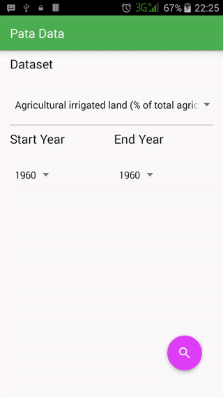
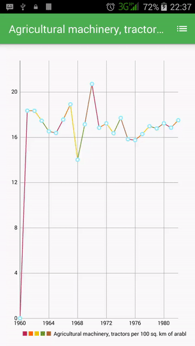

# Pata Data
A way to access World Bank APIs for open datasets. 

## Introduction :point_up:

Pata Data is an Android application designed to get World Bank data and display it. It is 
built on top of the [Android Volley Framework] (https://developer.android.com/training/volley/index.html).

## How To Use :wrench:

Please follow these steps to use the app:
1. Install the app.
2. Run the app.
3. You will find a screen that allows you to select a dataset as well as the start and end years for the dataset.
4. Select the search button on the bottom right to as to fetch the dataset information from World Bank.
5. After the data is gotten from the World Bank, it will be displayed in chart form.
6. Press the back button to go back to the dataset selection screen. 

The video below shows the previously mentioned steps.

 

You can also choose to view the data in tabular form. Here is how to do it:
1. In the screen showing the graphical form of the data, tap the table icon to see the data in tabular form.
2. If you want to go back to the chart, tap the chart icon the table screen.

The video below shows this.

 

## Abilities :muscle:

This app has the superpowers to:
* fetch (some relevant) World Bank datasets about Kenya in JSON form.
* display the datasets in a scrollable list.
* display the datasets in graph form.

## Limitations :worried:

This app is currently unable to:
* fetch datasets about another country.
* edit app settings.

Also, there are some hurdles inherent in the World Bank datasets themselves. These include:
* datasets missing data on particular years, 
* datasets having '''java 0.0''' as the value for all data in all the years between the start and the end year. This scenario can be seen in the video below:
 

## Possible Future Work :fast_forward:

As of today Tuesday, May 24, 2016, some of the things that should be implemented are:
- [ ] A settings section for user customization. We attempt to do this in the create-settings branch.

## Other things :books:

This is my first uploaded app that I apploaded myself. :bowtie:

And the videos here demostrate the app working in portrait phone orientation. The app also works in landscape orientation. :smile:

## License :lock_with_ink_pen:

This repository is licensed under the [GNU General Public License Version 3](http://www.gnu.org/licenses/gpl-3.0.en.html).
